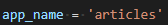
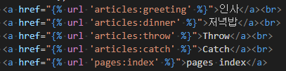

# 22_0303_TIL

## Django

- 장고는 웹 프레임워크로 보다 수월하게 웹 개발을 할 수 있도록 해주며 세계적인 기업들에 의해 사용되고 있다.

- MTV 디자인 패턴을 따르는데 이는 Model, Template, View의 약자로 각각 데이터 구조 정의 및 데이터베이스 기록 관리, 파일 구조 혹은 레이아웃 정의, HTTP 요청 수신 및 응답 반환의 역할을 한다.

- 장고의 LTS(Long Term Support)는 3.2버전이기 때문에 이를 설치해주는 것이 좋다.

- 프로젝트를 시작할 때는 반드시 다음의 순서로 하자.
  1. 가상환경 생성 및 활성화(`python -m venv (가상환경 이름)`)
  2. django 설치(`pip install django==3.2.12`)
  3. 프로젝트 생성(`django-admin startproject (프로젝트 이름) .`)
  4. 서버 켜서 로켓 확인하기(확인 됐으면 서버끄기)(`python manage.py runserver`)
  5. 앱 생성(`python manage.py startapp (앱 이름 복수형으로)`)
  6. 앱 등록(프로젝트의 settings.py 안의 installed app 리스트에 문자열 형태로 적어주기)
  
  
  
- 하나의 프로젝트는 여러 앱의 집합이며 앱은 여러 프로젝트에 있을 수 있다. 

- 서버에 요청이 들어오면 가장 먼저 받는 부분이 URLs이며 여기에서 view 함수와 연결시켜준다. view에서는 다시 template과 상호작용하여 응답을 반환한다.

- view함수의 첫번째 인자는 무조건 request(요청)으로 받는다.

### DTL

- django template language
- 조건, 반복, 변수치환, 필터 등의 기능을 제공하며 파이썬과 비슷한 문법을 사용하지만 파이썬이 구동되는 것은 아니다.
- 로직이 아니라 표현을 위한 것
- 변수, 필터, 태그 등이 있고 변수가 가장 중요하다. 변수는 {{ 변수명 }}으로 접근한다. 태그는 으로 사용한다.
- 이렇게 변수를 지정해주는 곳은 view함수에서이고 template에서는 이를 접근하는 것이다.
- ``,  , `` 이 태그들을 통해 템플릿을 상속하고, 상속 받고, 다른 템플릿의 내용을 가져올 수 있다.
- url주소를 변수로 사용하는 것을 variable routing이라고 하며 이를 사용하면 경로를 하드코딩하지 않고 태그와 이름을 통해 링크를 사용할 수 있다.
- 각 앱들의 url은 mapping하여 사용할 수 있으며 이를 위해 프로젝트의 urls.py에 import include를 해준다.
- 각 앱에서 url 이름이 같을 수 있는데 이럴 때 하나의 앱 페이지에서 다른 앱의 페이지로 넘어갈 때 오류가 발생할 수 있다. 이를 막기 위해 url에 앱도 이름을 지정해주는데 각 앱의 urls.py에 다음과 같은 방식으로 지정해주고 템플릿에서는 다음과 같이 사용한다.

